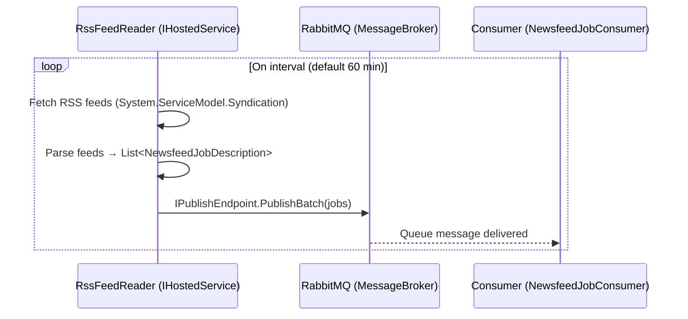
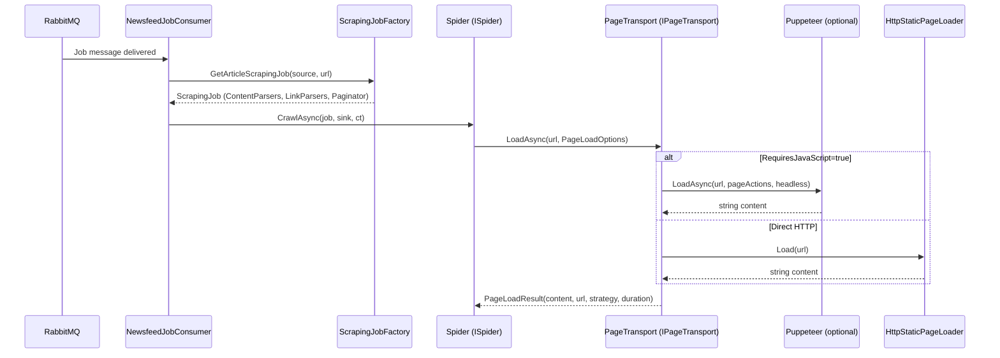
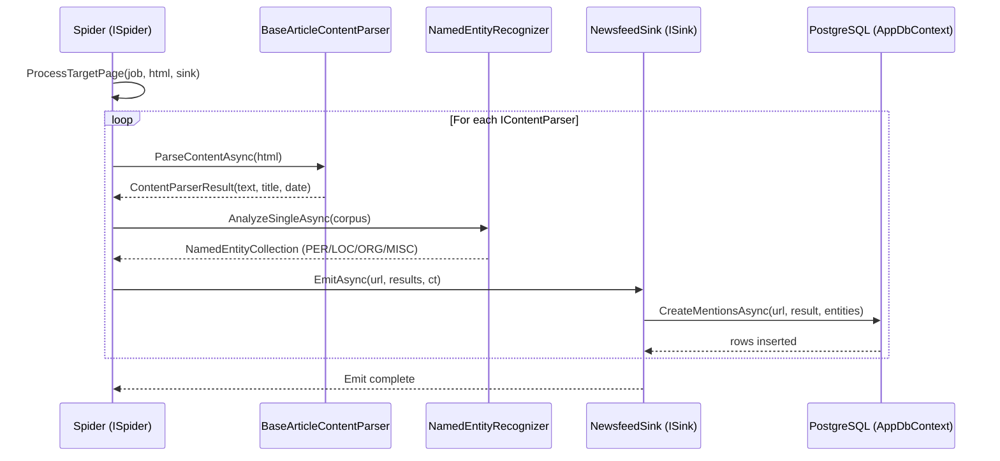
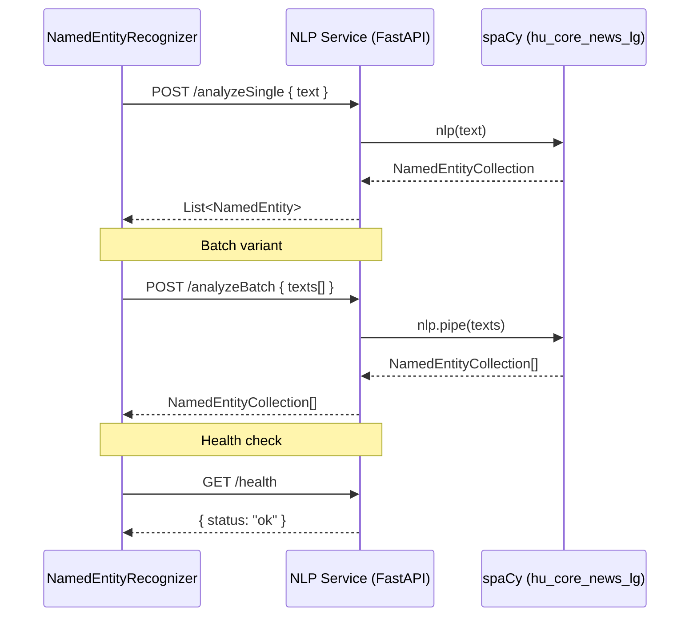
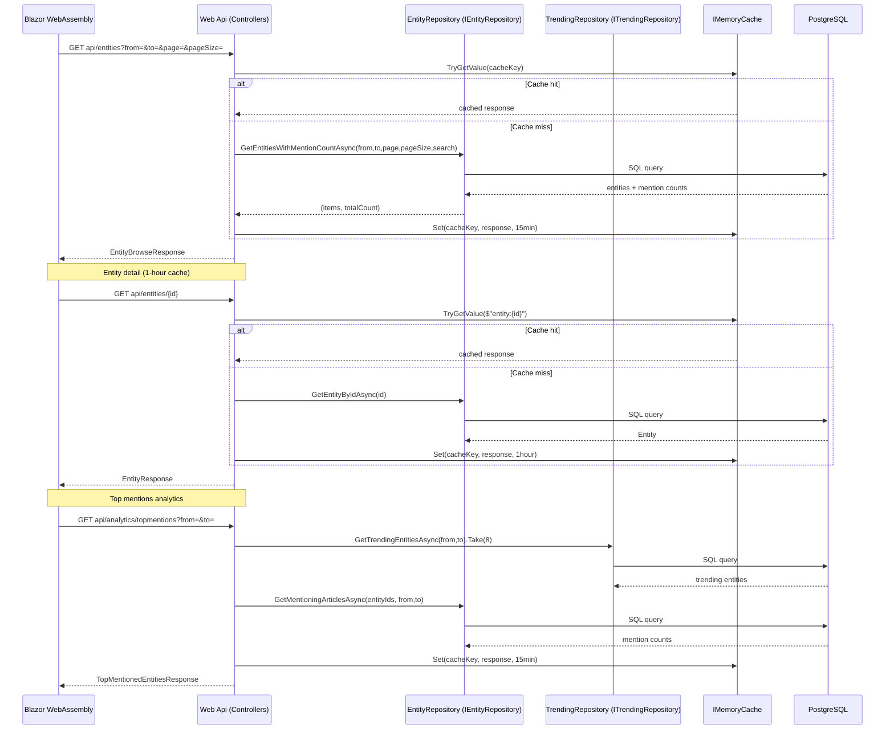
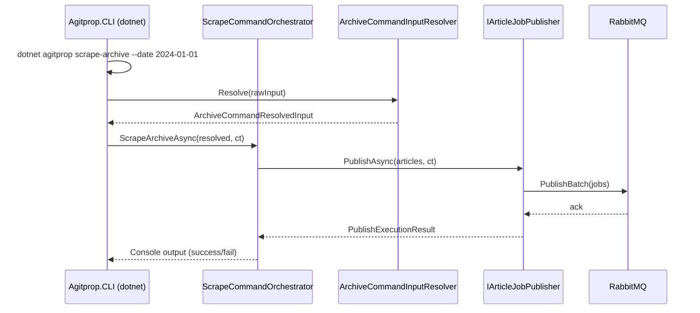
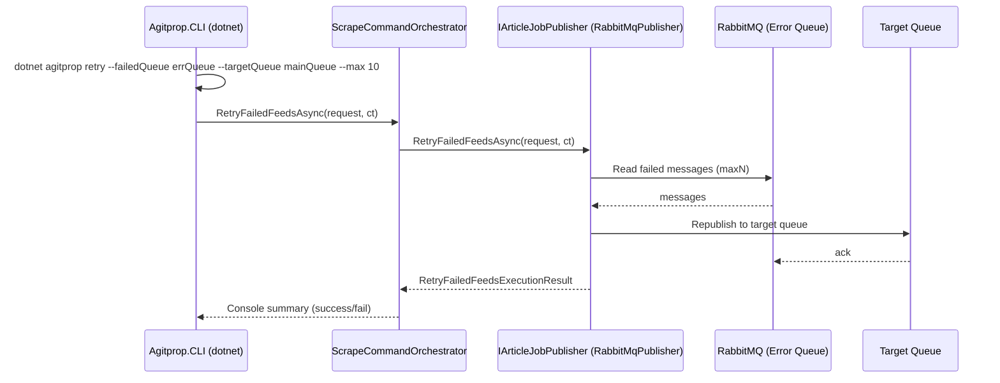

# AgitpropScraper — Pipelines

This document contains **Mermaid sequence diagrams** for every major pipeline in
the system, plus a step-by-step runtime walkthrough.

---

## 1. RSS Feed → Queue Pipeline



## 2. Job Consumption → Spider Crawl Pipeline



## 3. Target Page Parsing → Sink Pipeline



## 4. Link Discovery & Pagination Pipeline

```mermaid
sequenceDiagram
    participant SPIDER as Spider (ISpider)
    participant LINK as ILinkParser
    participant PAGINATOR as IPaginator
    participant SINK as NewsfeedSink (ISink)
    participant MQ as RabbitMQ

    SPIDER->>SPIDER: ProcessPage(job, html)
    loop For each ILinkParser
        SPIDER->>LINK: GetLinksAsync(baseUrl, doc)
        LINK-->>SPIDER: List<ScrapingJobDescription>
    end
    SPIDER->>PAGINATOR: GetNextPageAsync(currentUrl, doc)
    PAGINATOR-->>SPIDER: next ScrapingJobDescription
    SPIDER->>SINK: CheckPageAlreadyVisited(url)
    SINK-->>SPIDER: bool exists
    alt !exists
        SPIDER->>MQ: PublishBatch(nextJobs)
    end
```

## 5. NLP Service Pipeline



## 6. Web API → Blazor Client Pipeline



## 7. CLI Pipeline (scrape-archive)



## 8. CLI Retry Pipeline



---

## Runtime Step-by-Step Walkthrough

### Step 1: Aspire Startup

```
dotnet run --project Agitprop.AppHost/Agitprop.AppHost.csproj
```

1. **AppHost** creates the `DistributedApplication` builder.
2. Registers the container registry `ghcr.io/fortyfei/agitprop` (via `WithEnvironmentAwareImagePush`).
3. Creates the docker-compose environment `agitprop` with:
   - **Dashboard** on `:18888`
   - **RabbitMQ** (`messaging`) — mgmt `:15672`, AMQP `:5672`, OTLP
   - **PostgreSQL** (`postgres`) — data volume, pgAdmin `:5050`, persistent lifetime, OTLP
   - **Database** `newsfeed` attached to PostgreSQL
   - **NLP service** (`nlpservice`) — `uvicorn app:app`, health check `:8111/health`
   - **Consumer**, **RSS Feed Reader**, **Web API**, **Web Client** projects
4. Each service waits for its dependencies (see component table in architecture.md).

### Step 2: Service Startup Order

1. **RabbitMQ** starts first (infrastructure).
2. **PostgreSQL** + **Database** start next.
3. **NLP Service** (`nlpservice`) starts and loads `hu_core_news_lg` model.
4. **Consumer** waits for `newsfeedDb`, `messaging`, `nlpService`. Applies EF migrations if Development or `ApplyMigrationsAtStartup=true`. Registers MassTransit endpoints.
5. **RSS Feed Reader** waits for `messaging`, `Consumer`. Registers as `IHostedService`.
6. **Web API** waits for `newsfeedDb`, `messaging`. Applies migrations. Maps controllers.
7. **Web Client** waits for backend (Web API) + external HTTP. Blazor InteractiveServer rendering.

### Step 3: Runtime Operation

1. **RSS Feed Reader** fetches feeds on interval → `IPublishEndpoint.PublishBatch`.
2. **Consumer** consumes from queue → `ScrapingJobFactory.GetArticleScrapingJob` → `ISpider.CrawlAsync`.
3. **Spider** uses `IPageTransport.LoadAsync` → `HttpStaticPageLoader` (or `PuppeteerPageLoader` if browser mode).
4. **BaseArticleContentParser** extracts date/title/lead/article via XPath fallback lists.
5. **NamedEntityRecognizer** POSTs to NLP service `/analyzeSingle` → returns `NamedEntityCollection`.
6. **NewsfeedSink** persists to PostgreSQL via `AppDbContext.CreateMentionsAsync`.
7. **Web API** serves entity browse/analytics from PostgreSQL (cached 15 min / 1 hour).
8. **CLI** can re-queue failed messages via `retry` command.